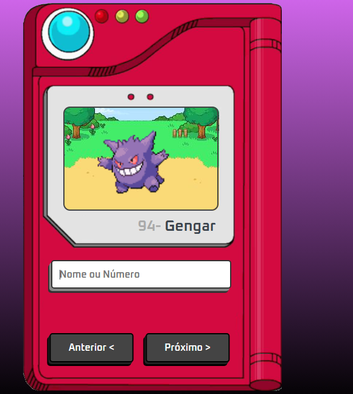
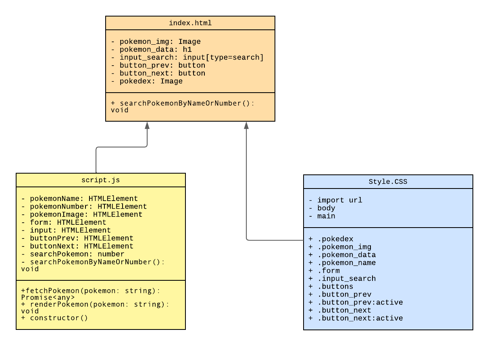

# Pokedex-em-frontend

## Objetivo do projeto
Projeto para estudo com a utilização de API na linguagem JavaScript.

## Tecnologias
* [Visual Studio Code](https://code.visualstudio.com/) - IDE de desenvolvimento
* [HTML5](https://developer.mozilla.org/pt-BR/docs/Web/HTML) - Linguagem utilizada
* [CSS](https://developer.mozilla.org/pt-BR/docs/Web/CSS) - Linguagem utilizada
* [JavaScript](https://developer.mozilla.org/pt-BR/docs/Web/JavaScript) - Linguagem utilizada
* [API do pokémon](https://pokeapi.co/) - API oficial do Pokémon

## Modelagem de projeto

[Acesse pelo Lucid](https://lucid.app/lucidspark/979100c6-d9ed-46e2-ba58-486e99840b06/edit?viewport_loc=-488%2C-40%2C2622%2C1314%2C0_0&invitationId=inv_16f709cd-6ac8-434b-93f4-dcac285946d2) 

## Conceitos abordados 
Utilização estrutural do HTML, como, formulário, botões e textos. Estilização de textos, inclusão de fontes específicas, layout responsivo, carregamento assíncrono, gerenciamento de eventos e inclusão de API com Javascript.

## Requisitos para o projeto funcionar
I. Ter a IDE Visual Studio Code instalado;

 
II. Obter as demais configurações de extensões como desejar (Para facilitar a visualização de código, recomendo extensões visuais); 

III. Fazer download do repositório e depois extrair para o local de sua preferência;

 IV. Abrir a pasta com do repositório na IDE (certifique-se que todos os arquivos de linguagem serão abertos);

  V. Clique em Run > Start Debuggin ou aperte F5, escolha seu navegador padrão para interação com o projeto, aproveite!

   VI. Ou tente pelo caminho mais fácil através da criação de URL do deploy, [acesse clicando aqui](https://giovannalogy.github.io/Pokedex-em-frontend/), lá você consegue interagir com a Pokédex.

## Como acessar o código 
* [Código HTML](https://github.com/giovannalogy/Pokedex-em-frontend/blob/main/index.html)
* [Código CSS](https://github.com/giovannalogy/Pokedex-em-frontend/blob/main/css/style.css)
* [Código JavaScript](https://github.com/giovannalogy/Pokedex-em-frontend/blob/main/js/script.js)
